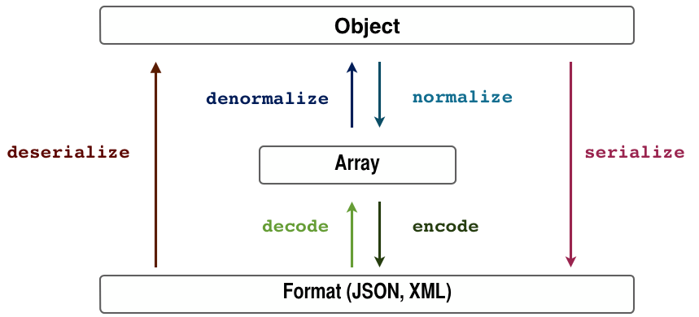

# API REST SYMFONY

## Init Projet

```
composer create-project symfony/skeleton api_rest_symfony
```

## Dependancies

### Profiler

Le profileur est un outil de développement puissant qui donne des informations détaillées sur l'exécution de toute demande. N'activez jamais le profileur dans les environnements de production car cela entraînerait des vulnérabilités de sécurité majeures dans votre projet.

install :
```
composer require --dev symfony/profiler-pack
```

### JMSSerializerBundle

JMSSerializerBundle vous permet de sérialiser vos données dans un format de sortie demandé tel que JSON, XML ou YAML, et vice versa.

```
composer require jms/serializer-bundle
```
### httpFoundation

Définit une couche orientée objet pour la spécification HTTP.

Installation : 

```
composer require symfony/http-foundation
``` 

### SensioFrameworkExtraBundle

Le Symfony par défaut FrameworkBundleimplémente un framework MVC basique mais robuste et flexible. SensioFrameworkExtraBundle l' étend pour ajouter des conventions et des annotations douces. Il permet des contrôleurs plus concis.

Installation :

```
composer require annotations
```

### API PLATFORM

API Platform Core est une bibliothèque puissante et facile à utiliser pour créer des API REST basées sur l'hypermédia . C'est un composant du framework API Platform . Il peut être utilisé de manière autonome ou avec le framework Symfony (recommandé).

Il intègre les standards Web JSON for Linked Data (JSON-LD) et Hydra Core Vocabulary , mais prend également en charge HAL , Swagger / Open API , XML, JSON, CSV et YAML.

Créez une API CRUD fonctionnelle et complète en quelques minutes. Tirez parti des fonctionnalités impressionnantes de l'outil pour développer des projets API-first complexes et hautes performances.

install : 

```
composer require api
```

#### Activer ou désactiver des opérations
exemple
```
<?php

// src/Entity

namespace App\Entity;

use ApiPlatform\Core\Annotation\ApiResource;
use Doctrine\ORM\Mapping as ORM;

/**
 * @ApiResource(
 *     collectionOperations={"get"},
 *     itemOperations={"get", "put", "delete"}
 * )
 * @ORM\Entity(repositoryClass="App\Repository\ArticleRepository")
 */
class Article
{
    // ...
}
```
#### Sérialisation / Désérialisation


#### DataPersister
Exemple :
```
<?php

// src/DataPersister

namespace App\DataPersister;

use ApiPlatform\Core\DataPersister\ContextAwareDataPersisterInterface;

class ArticleDataPersister implements ContextAwareDataPersisterInterface
{
    public function supports($data, array $context = []): bool
    {
        // TODO: Implement supports() method.
    }

    public function persist($data, array $context = [])
    {
        // TODO: Implement persist() method.
    }

    public function remove($data, array $context = [])
    {
        // TODO: Implement remove() method.
    }
}
```

supports — cette méthode défini si ce persister supporte l'entité. Au fait c'est cette méthode qui dira si ce persister est pour l'entité Article ou pas

persist — cette méthode va créer ou modifier les données, c'est donc cette méthode qui sera appelée à chaque opération POST, PUT ou PATCH

remove — cette méthode sera appelée pour l'opération DELETE

#### String 

Le composant String fournit une API orientée objet unique pour travailler avec trois «systèmes unitaires» de chaînes: octets, points de code et clusters de graphèmes.

```
composer require symfony/string
````

### MakerBundle

Symfony Maker vous aide à créer des commandes vides, des contrôleurs, des classes de formulaire, des tests et plus encore afin que vous puissiez oublier l'écriture de code standard.

```
composer require symfony/maker-bundle --dev

php bin/console make:entity
```

Ressources :

> https://www.kaherecode.com/tutorial/developper-une-api-rest-avec-symfony-et-api-platform